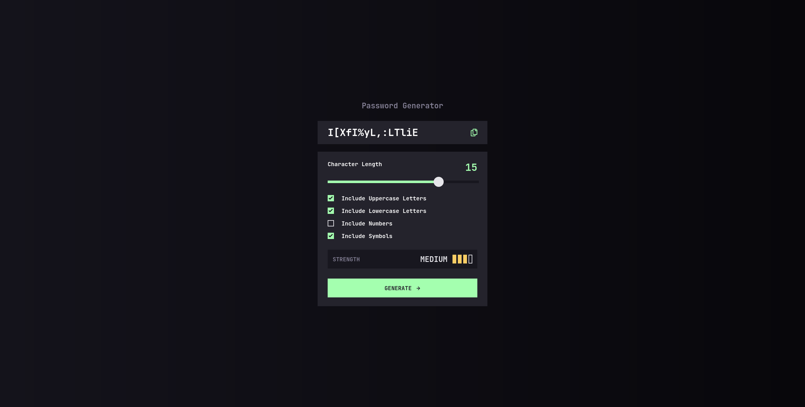

# Frontend Mentor - Password generator app solution

This is a solution to the [Password generator app challenge on Frontend Mentor](https://www.frontendmentor.io/challenges/password-generator-app-Mr8CLycqjh). Frontend Mentor challenges help you improve your coding skills by building realistic projects. 

## Table of contents

- [Overview](#overview)
  - [The challenge](#the-challenge)
  - [Screenshot](#screenshot)
  - [Links](#links)
- [My process](#my-process)
  - [Built with](#built-with)
  - [What I learned](#what-i-learned)
  - [Useful resources](#useful-resources)
  - [AI Collaboration](#ai-collaboration)
- [Author](#author)
- [Acknowledgments](#acknowledgments)

## Overview

### The challenge

Users should be able to:

- Generate a password based on the selected inclusion options
- Copy the generated password to the computer's clipboard
- See a strength rating for their generated password
- View the optimal layout for the interface depending on their device's screen size
- See hover and focus states for all interactive elements on the page

### Screenshot


### Links

- Solution URL: [Code](https://github.com/Zuzana83/password-generator-app)
- Live Site URL: [Live site](https://zuzana83.github.io/password-generator-app/)


## My Process

### Built With

- Semantic HTML5
- CSS custom properties
- Mobile-first workflow
- Vanilla JavaScript
- Fisher-Yates shuffle algorithm

### What I Learned

This project surprised me with how much heavy lifting CSS can do 
without any JavaScript.

**CSS `:empty` pseudo-class** — Instead of using JavaScript to 
toggle placeholder text on the password display, CSS handles it 
natively. When the element has no content, a styled placeholder 
appears automatically:

```css
.password-text:empty::before {
    content: "P4$5W0rD!";
    color: var(--grey-700);
}
```

**CSS `nth-child(-n+3)` for strength indicators** — Instead of 
adding individual classes to each bar, one class on the parent 
handles all states:

```css
.indicators-wrapper.medium .indicator:nth-child(-n+3) {
    background-color: var(--yellow-300);
}
```

**Dynamic slider fill** — Updating a CSS custom property from 
JavaScript creates a live fill effect on the range input:

```javascript
sliderEl.style.setProperty("--fill", `${percentage}%`);
```

**CSS tooltip without JavaScript** — The copy button tooltip 
uses only CSS with `data` attributes:

```css
.copy-btn.copied::after {
    content: attr(data-tooltip);
}
```

**Password strength scoring** — The most challenging part was 
designing a fair scoring system. I learned from security research 
that password LENGTH matters more than character variety — a 20 
character lowercase password is exponentially harder to crack than 
a short password with all character types. My scoring reflects this:

- Length contributes up to 55 points
- Character variety contributes up to 45 points
- Strong rating requires 85+ points

**Fisher-Yates shuffle** — To prevent predictable patterns 
(uppercase first, then lowercase etc), I implemented the 
Fisher-Yates algorithm to randomize the final password.

### Useful Resources

- [Fisher-Yates Shuffle](https://medium.com/@khaledhassan45/how-to-shuffle-an-array-in-javascript-6ca30d53f772) 
  — Helped me understand array shuffling
- [MDN - nth-child](https://developer.mozilla.org/en-US/docs/Web/CSS/:nth-child) 
  — CSS selector reference

### AI Collaboration

Using AI as a mentor has become my pattern over the last several projects, and this one followed the same process: asking about the theory behind a concept first, building my own draft, testing it myself and reporting back the actual results, then iterating based on what I found — rather than being handed a solution outright. What I value most about this approach isn't just getting the project built, but understanding the *why* behind each decision and each bug, in a way that building projects entirely on my own has never gotten me to as quickly or as thoroughly.

## Acknowledgments

Thanks to this AI mentor/guide approach I am able to solve more complex projects, learn new concepts, explore more advanced javascript which I would not be able to do just on my own, without verifying I understand theory and implement it correctly. 